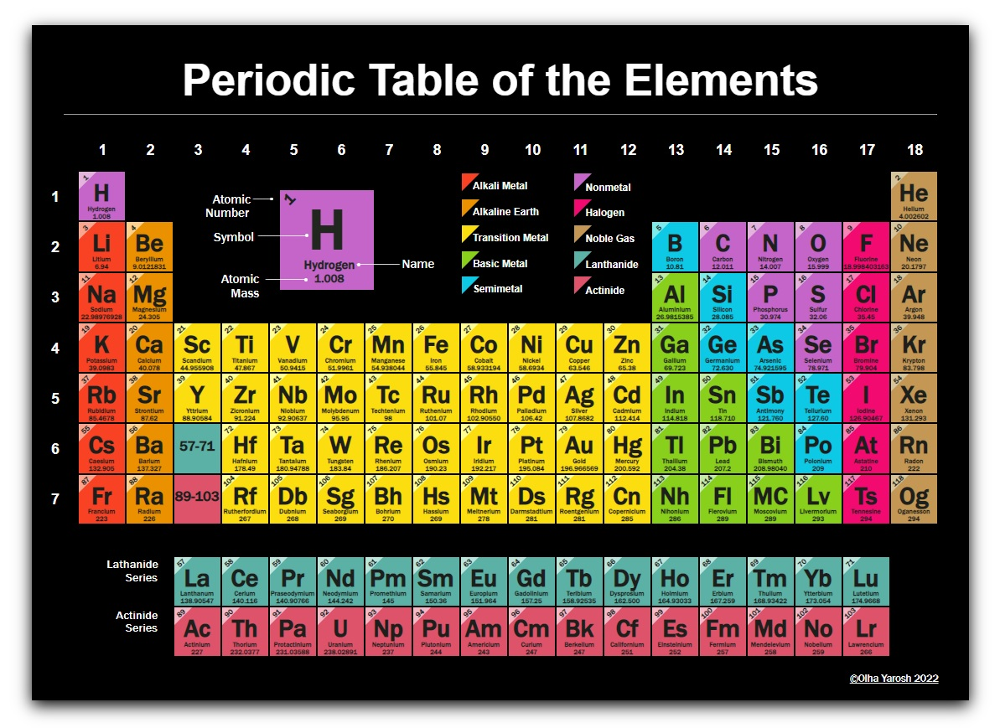
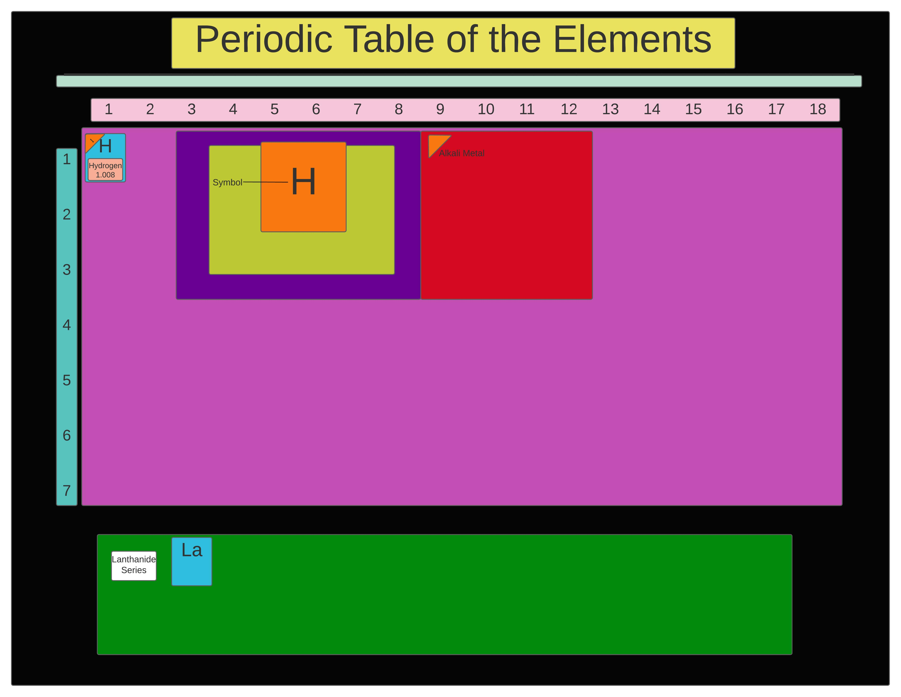

# Periodic Table of the Elements

The periodic table of the elements is a tabular display of the chemical elements. It is widely used in chemistry, physics, and other sciences, and is generally seen as an icon of chemistry. It is a graphic formulation of the periodic law, which states that the properties of the chemical elements exhibit a periodic dependence on their atomic numbers.

## Built with
* HTML
* CSS
  
## How to run
Open `index.html` in any browser.

## The final look

## Wireframing in Lucid.app

